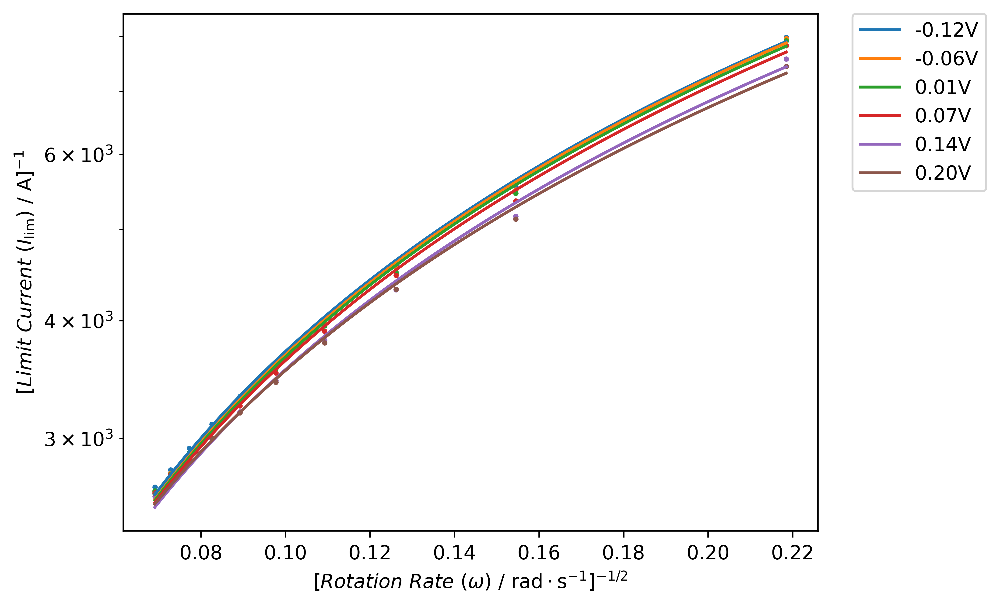

# Abstract
Envismetrics is an open-source, cross-platform Python application designed to assist researchers in the automated analysis of electrochemical data. It provides a modular toolbox that enables the processing, visualization, and parameter extraction of data from techniques such as cyclic voltammetry, chronoamperometry, and hydrodynamic voltammetry. The software supports data input from a variety of potentiostat platforms and automates routine analytical steps, including peak identification, Randles–Ševčík plots, diffusion coefficient estimation, rate constant calculations, and Tafel analysis. Envismetrics features a graphical web interface that minimizes the need for coding and enhances accessibility for researchers across disciplines.
By focusing on automation and reproducibility, Envismetrics reduces the manual workload associated with electrochemical data interpretation and promotes transparent research workflows. The source code is openly available at [https://github.com/Woffee/Envismetrics](https://github.com/Woffee/Envismetrics).

# Summary

Accurate determination of kinetic parameters and thermodynamic properties from electrochemical data is fundamental for understanding redox reactions used in diverse applications [@SANECKI2003109, @wang2020redox, @XU20106366]. These values — including diffusion coefficients, standard rate constants, transfer coefficients, and formal potentials — provide mechanistic insight and are commonly used to validate reaction pathways and simulate electrochemical behavior under various conditions [@C9CP05527D].

Although literature values exist for some well-studied redox systems, the evaluation of new analytes or experimental conditions typically requires experimental determination. Techniques such as cyclic voltammetry (CV), linear sweep voltammetry using a rotating disk electrode (LSV at RDE, under laminar flow and planar diffusion conditions), and step methods like chronoamperometry (CA) offer quantitative frameworks for extracting these parameters [@bard2022electrochemical].

Each technique supports specific analyses:

- **LSV at RDE**: Levich and Koutecký–Levich analysis [@doi:10.1021/ar50110a004; @treimer2002koutecky],
- **CV**: Randles–Ševčík plots, rate constant estimation, and transfer coefficient analysis [@doi:10.1002/adts.202500346; @LEFTHERIOTIS2007259],
- **CA**: Cottrell-based diffusion coefficient estimation [@HERATH20084324; @GOMEZ2023143400; @RODRIGUEZLUCAS2025145648].

While these methods are widely accepted, manual analysis can be labor-intensive and prone to inconsistency. To address this, **Envismetrics** is introduced as an open-source, browser-based Python application that automates data processing and analysis workflows for CV, LSV (RDE), and CA. It provides modules for filtering, peak detection, Levich regression, Randles–Ševčík analysis, and chronoamperometric fitting—offering visual outputs and tabulated results. By focusing on automation and reproducibility, Envismetrics lowers the barrier for electrochemical researchers—especially those dealing with large datasets or requiring rapid feedback—while preserving methodological rigor and transparency.

## Statement of Need

Electrochemical researchers often rely on a mix of tools for data analysis and visualization. Manual spreadsheet workflows (e.g., Excel) and general-purpose plotting software (e.g., Origin, SigmaPlot) are flexible, but they require significant manual preprocessing, repeated formatting, and substantial domain expertise for kinetic modeling. Proprietary instrument software (e.g., NOVA for Autolab) is primarily intended for device control and data acquisition; while it offers basic plotting, it is instrument-specific and is rarely used for in-depth data analysis [@Garg2021]. Researchers with strong programming skills sometimes develop custom analysis scripts in MATLAB or Python, but this demands considerable coding effort, debugging, and domain-specific implementation, which can be a barrier for many users.

Envismetrics addresses this gap by providing a modular, web-based platform dedicated to automated analysis of electrochemical data, including cyclic voltammetry (CV), rotating disk electrode linear sweep voltammetry (LSV at RDE), and chronoamperometry (CA). It supports widely used plaintext formats such as `.xlsx`, `.csv`, and `.txt`, allowing researchers to export data from most proprietary workstation software and perform consistent, reproducible analysis without being tied to a specific vendor.  

Its modular architecture supports both platform expansion (potential of compatibility with additional electrochemical workstations) and method expansion (new analytical techniques). For example, while Envismetrics currently supports CV, LSV at RDE, and CA, it can be extended to include electrochemical impedance spectroscopy (EIS) and other workflows with minimal changes to the core system.

Envismetrics prioritizes data processing, reproducibility, and accessibility. It offers automated peak detection, Levich and Randles–Ševčík analysis, rate constant estimation, and stepwise analysis modules. Its browser-based design allows it to run on Windows, macOS, and Linux without installation, making it suitable for both research and teaching environments.

| **Aspect**             | **Proprietary Instrument Software (e.g., NOVA)** | **Envismetrics**                                                      | **General Tools (Excel / Origin)**               |
|------------------------|--------------------------------------------------|------------------------------------------------------------------------|---------------------------------------------------|
| **Data Format Support**| Vendor-specific native formats                   | `.xlsx`, `.csv`, `.txt` (plaintext from system)                        | Multiple formats, manual setup required          |
| **Analysis Features**  | Basic plotting, smoothing, baseline correction   | Automated Levich/Randles–Ševčík, peak detection, rate fitting          | Manual curve fitting, limited built-in models    |
| **Extensibility**      | Limited                                           | Modular architecture; easily adds new methods                         | Requires manual scripting                        |
| **Ease of Use**        | Steep learning curve; instrument-specific menus  | Intuitive GUI with guided steps                                        | Manual data cleaning and formatting required     |
| **Output Quality**     | Basic plots                                       | Clean, exportable plots                                                 | Depends on user formatting skills                |
| **Installation & Platform Support** | Windows-only; local install                 | Web-based; no installation; works on Windows, macOS, Linux              | Local install; Windows, macOS, Linux             |

[Comparison of Electrochemical Data Analysis Software]\label{table:1}

# Current Functions of Envismetrics Toolbox

To aid in interpreting the equations below, Table 2 summarizes commonly used electrochemical parameters along with their meanings and corresponding units.

> **Note**:  
> • The symbol $\nu$ appears twice in the table with different meanings:  
> &nbsp;&nbsp;&nbsp;&nbsp;– In **CV**, it denotes the *scan rate*, with units of $\mathrm{V/s}$.  
> &nbsp;&nbsp;&nbsp;&nbsp;– In **HDV (RDE)**, it denotes the *kinematic viscosity*, with units of $\mathrm{cm^2/s}$.  
> • Both the *diffusion coefficient* $D$ and *kinematic viscosity* $\nu$ share the unit $\mathrm{cm^2/s}$, but represent distinct physical phenomena—molecular diffusion and fluid flow, respectively.

| **Symbol**          | **Meaning**                                       | **Unit**               | **Context**       |
| ------------------- | ------------------------------------------------- | ---------------------- | ----------------- |
| $n$                 | Number of electrons transferred in redox reaction | —                      | All methods       |
| $n'$                | Number of electrons in preceding equilibrium      | —                      | CV (irreversible) |
| $F$                 | Faraday constant                                  | $\text{C/mol}$         | All methods       |
| $R$                 | Ideal gas constant                                | $\text{J/mol·K}$       | All methods       |
| $T$                 | Temperature                                       | $\text{K}$             | All methods       |
| $\nu$               | Scan rate (CV)                                    | $\text{V/s}$           | CV                |
| $\nu$               | Kinematic viscosity (HDV)                         | $\text{cm}^2/\text{s}$ | HDV (RDE)         |
| $D$                 | Diffusion coefficient                             | $\text{cm}^2/\text{s}$ | All methods       |
| $A$                 | Electrode area                                    | $\text{cm}^2$          | All methods       |
| $C$, $C_0$          | Concentration of electroactive species            | $\text{mol/cm}^3$      | All methods       |
| $I_{\text{peak}}$   | Peak current                                      | $\text{A}$             | CV                |
| $j$                 | Current density                                   | $\text{A/cm}^2$        | CV                |
| $\theta$            | Dimensionless overpotential                       | —                      | CV                |
| $\alpha$, $\alpha'$ | (Apparent) transfer coefficient                   | —                      | CV                |
| $k_0$               | Standard rate constant                            | $\text{cm/s}$          | CV                |
| $\Psi$              | Dimensionless kinetic parameter                   | —                      | CV                |

[Summary of parameters used in electrochemical equations]\label{table:2}

## Data Processing

Envismetrics supports plain-text electrochemical data formats, including `.xlsx`, `.csv`, and `.txt`, exported from supported potentiostat software. The current release has been validated with files from Autolab’s NOVA and BioLogic’s EC-Lab (for CV analysis), with additional formats planned for future updates as documented in the repository. Users can upload these files directly to the web-based interface without additional preprocessing, provided they follow the standard export structures of the supported software. The software automatically parses time, current, and potential data for downstream analysis, with built-in file name and format validation to ensure compatibility and alert users to formatting issues.

{ width=80% }

## Hydrodynamic Voltammetry (HDV) - Rotating Disc Electrode (RDE) Module

### Function 1: Plotting and Gaussian Filtering

This function plots the experimental data sorted by RPM (rotations per minute) and provides an optional Gaussian smoothing feature. Users may specify a sigma value to apply the filter — larger sigma values result in smoother curves by reducing high-frequency noise, but can also suppress sharp features in the data. To disable filtering, users should set sigma = 0.

The Gaussian filter works by convolving the current signal with a normal distribution (Gaussian kernel), helping to visualize trends in noisy electrochemical data. However, users are advised to apply filtering judiciously, as excessive smoothing may obscure important peaks or kinetic features.

### Function 2: Levich and Koutecky–Levich Analysis

Levich and Koutecky–Levich (KL) analyses are commonly used for studying electrochemical reactions under laminar flow convection conditions [@masa2014koutecky]. *Envismetrics* streamlines these workflows by automatically generating both Levich and KL plots from experimental data.

Levich analysis is primarily used to determine the diffusion coefficient $D$ under mass-transport-limited conditions. The classical Levich equation is:

$$
i_L = 0.62\, n F A D^{2/3} \omega^{1/2} \nu^{-1/6} C
$$

Koutecky–Levich analysis expands on this by incorporating kinetic limitations and is often used to estimate the standard rate constant $k_0$. It retains the same diffusion-related slope as the Levich plot. The KL equation is:

$$
\frac{1}{i} = \frac{1}{i_k} + \frac{1}{i_L}
$$

Or explicitly:

$$
\frac{1}{i} = \frac{1}{n F A k^0 C} + \frac{1}{0.62\, n F A D^{2/3} \omega^{1/2} \nu^{-1/6} C}
$$

In *Envismetrics*, users can select potential values to automatically generate these plots, with slopes and derived kinetic parameters $D$ calculated dynamically for each potential. This feature enables users to explore the potential dependence of apparent kinetics and identify plateaus where mass transport dominates. Users should apply Levich/KL analyses only in regions where steady-state limiting currents are observed. *Envismetrics* allows flexible selection of such regions, but interpretation should follow electrochemical theory to avoid applying these models in inappropriate potential windows. The Koutecky–Levich analysis module is under active development to support the calculation of kinetic parameters, including the standard heterogeneous rate constant $k_0$ and the charge-transfer coefficient $\alpha$.

> **Note**: While *Envismetrics* may display diffusion coefficients calculated at multiple potentials under inappropriate potential range settings, this is **not intended to imply that $D$ varies with potential**. Rather, each $D$ value is obtained by applying the **definitional form** of the Levich and Koutecky–Levich equation at that specific potential.
> 
> Users are advised to select only steady-state plateau potentials for quantitative Levich and Koutecky–Levich analysis.

<figure style="width: 100%; margin: auto; text-align: center;">
  
  <figcaption><strong>Figure 2.</strong> Koutecky–Levich plot module (logarithmic scale on the y-axis).</figcaption>
</figure>

## Cyclic Voltammetry (CV) Module

### Function 1: Plotting and Gaussian Filtering

This function plots cyclic voltammetry data sorted based on the rate constant value and allows users to apply a Gaussian filter for smoothing. Users can input the sigma value to adjust the degree of smoothing. Both the original figure and the smoothed data will be displayed, allowing users to compare the raw and processed results.

### Function 2: Peak Searching

Peak searching is essential for calculating formal potential, peak separation, and performing Randles-Ševčík analysis. The software provides multiple searching methods, such as max/min and knee/elbow detection within specific ranges, allowing the analysis of multiple peaks and complex reactions. The software will record all the peak points for use in future analyses, and the results will be displayed in a plot.

### Function 3: Randles–Ševčík Analysis

The Randles–Ševčík analysis utilizes equations that incorporate the transfer coefficient and calculate the diffusion coefficient from the peak current and scan rate. This function supports both reversible and irreversible versions of the Randles–Ševčík equation [@zanello2019inorganic]. The peak information data used in this analysis is obtained from Function 2 (Peak Searching):

$$
I_{\text{peak}} = 0.4463 \ n \ F \ C \ A \sqrt{\frac{n F \nu D}{R T}}
$$

$$
I_{\text{peak}} = 0.4463 \sqrt{n^{\prime} + \beta} \ n \ F \ C \ A \sqrt{\frac{n F \nu D}{R T}}
$$

In the implementation, setting \(\sqrt{n^{\prime} + \beta} = 1\) corresponds to the reversible case. For irreversible cases, \(\sqrt{n^{\prime} + \beta}\) is computed from user-specified \(\alpha\) and \(n'\) values. This design allows the same computational pipeline to handle both cases while preserving explicit parameter control for advanced users.

### Function 4: Standard Rate Constant Calculation (Advanced)

Function 4 implements an advanced, optional method for estimating the standard heterogeneous rate constant, $k_0$, using a dimensionless kinetic parameter, $\Psi$, that relates $k_0$ to the system’s electrochemical and physical properties. This approach is based on the classical Nicholson model [@nicholson1965theory] and extended by Lavagnini *et al.* [@lavagnini2004extended] to cover a broader range of peak separations ($\Delta E_p$), with additional support for the Klingler–Kochi formulation [@Klingler1981] in highly irreversible systems.

$$
\Psi = \frac{0.6288 + 0.0021 \cdot X}{1 - 0.017 \cdot X}, \quad X = \Delta E_p \cdot n \ \ (\text{in mV})
$$

where $X$ is normalized to millivolts to maintain the dimensionless nature of $\Psi$.

For systems with large $\Delta E_p$ or highly irreversible behavior, the Klingler–Kochi expression is applied:  

$$
\Psi = \frac{2.18}{\alpha \pi} \exp\left(-\frac{\alpha n \Delta E_p F}{2RT}\right)
$$

The standard rate constant is then obtained from:  

$$
k^0 = \Psi \cdot \left(\frac{D \cdot n \cdot F}{R \cdot T}\right)^{1/2}
$$

**Assumptions and Scope**  
This method assumes diffusion-controlled electron transfer without coupled chemical reactions or adsorption phenomena, and is most applicable to well-defined, peak-shaped CVs under quasi-reversible or irreversible conditions. The diffusion coefficient $D$ must be known or reliably estimated. Since the Lavagnini approach is empirical, optimal performance is expected when $k_0$ lies within an intermediate kinetic range. Users are advised to interpret $k_0$ results in accordance with electrochemical theory, and to restrict use of this feature to exploratory or comparative analysis rather than routine novice workflows.

### Function 5: Tafel Analysis Module

Tafel analysis is used to determine the anodic and cathodic transfer coefficients. The International Union of Pure and Applied Chemistry (IUPAC) formally defines these coefficients as experimentally determined values, given by [@guidelli2014defining]:

$$
\alpha_a = \frac{RT}{F} \left( \frac{d \ln j_{a, \text{corr}}}{dE} \right)
$$

$$
\alpha_c = -\frac{RT}{F} \left( \frac{d \ln |j_{c, \text{corr}}|}{dE} \right)
$$

Additionally, a mass-transport corrected version has been proposed and implemented in this module [@LI2018117]. This method has also been applied in other research, including the study of dopamine oxidation at gold electrodes conducted by Bacil and co-workers [@C9CP05527D]. The transfer coefficient is calculated by: 

$$
-\frac{d\ln \left( \frac{1}{I_a} - \frac{1}{I_{\text{peak}}} \right)}{d\theta} = \alpha_a'
$$

<!--
{ width=45% }
{ width=45% }

![Example of figures in Envismetrics(CV Module): (a) Peak Searching module, (b) Randles–Ševčík Analysis Module.]
-->

  <figure style="width: 49%;">
    
    <figcaption><strong>(a)</strong> Peak searching module (CV-2)</figcaption>
  </figure>
  <figure style="width: 49%;">
    
    <figcaption><strong>(b)</strong> Randles–Ševčík analysis module (CV-3)</figcaption>
  </figure>

<figcaption style="width: 100%; text-align: center; margin-top: 10px;">
  <strong>Figure 3.</strong> Visual outputs from the CV module: (a) Peak searching module (CV-2), (b) Randles–Ševčík analysis module (CV-3; conceptual output shown here, available in local version but not yet on the online platform).
</figcaption>

## Step Techniques Structure: CA Module

### Function 1: Plotting and Gaussian Filtering

This function generates plots of applied potential vs. time and corresponding current vs. time. Users have the option to input a sigma value to apply a Gaussian filter, which smooths the data for clearer visualization. Both the original and smoothed figures are displayed, allowing for easy comparison and analysis.

### Function 2: Cottrell Equation Plot

This function utilizes the Cottrell equation to calculate the diffusion coefficient from chronoamperometric (CA) data. The Cottrell equation describes the current response of an electrochemical system under planar diffusion control as a function of time:

$$
i(t) = \frac{nFA C_0 D^{1/2}}{\pi^{1/2} t^{1/2}} 
$$

In *Envismetrics*, users can input experimental parameters such as the fitting interval (number of the input files), $n$, $A$, and $C_0$. The software then plots $i(t)$ vs. $\sqrt{nFAC/\pi t}$ and performs linear regression to determine $D$. The outputs include both a regression figure and a summary table of calculated diffusion coefficients.

<!--
{ width=45% }
{ width=45% }

![Example of figures in Envismetrics(CA Module): (a) , (b).]
-->

  <figure style="width: 49%;">
    
    <figcaption><strong>(a)</strong> Current–time curve plotting module (CA-1)</figcaption>
  </figure>
  <figure style="width: 49%;">
    
    <figcaption><strong>(b)</strong> Diffusion coefficient regression module (CA-2)</figcaption>
  </figure>

<figcaption style="width: 100%; text-align: center; margin-top: 10px;">
  <strong>Figure 4.</strong> Output visualization from the CA module: (a) Current–time curve plotting module (CA-1), (b) Diffusion coefficient regression module based on Cottrell equation (CA-2).
</figcaption>

## Planned Features and Future Work

We are actively developing Envismetrics to improve usability, flexibility, and scientific rigor across all modules. Upcoming features include:

- **CV Module**
  - Fully automated peak detection across voltammetric cycles.
  - Regime diagnostics based on scan rate normalization (e.g., $i_p$ vs. $\sqrt{v}$ scaling) to identify deviations from planar diffusion behavior, preventing misuse of Randles–Ševčík or Tafel analyses.
  - Option for users to automatically discard non-conforming voltammograms to ensure dataset consistency.
  - Input parameter validation for key variables (e.g., electrode radius, diffusion coefficients, concentration) with real-time warnings for unphysical or inconsistent entries.

- **HDV (RDE) Module**
  - Automatic detection of limiting current plateaus to improve Levich and Koutecký–Levich regression accuracy.
  - Enhanced fitting diagnostics with feedback on linearity and potential outliers.

- **Global Features**
  - Additional filtering methods (e.g., Savitzky–Golay, Gaussian smoothing) for improved preprocessing of noisy data.
  - Interactive, user-defined fitting regions in regression plots for more flexible curve fitting workflows.
  - Export of processed results and figures in structured formats (CSV, JSON) to support reproducibility and downstream analysis.
  - Early-stage development of an **EIS analysis module**, enabling impedance spectroscopy integration with CV/CA workflows.

These features are currently under active development and will be released progressively. We welcome user feedback and contributions via GitHub Issues and Pull Requests.

## Applications in Research

Envismetrics has been employed in various research projects, demonstrating its versatility in the analysis of electrochemical systems. For instance, the software was utilized in the investigation of photocatalytic degradation of perfluorooctanoic acid (PFOA), published in *Chemosphere* [@OSONGA2024143057], where it facilitated the precise analysis of kinetic parameters essential to understanding the degradation mechanisms. Additionally, Envismetrics played a key role in mechanistic studies on the electrochemical oxidation of dimethylamine borane (DMAB), as documented in recent works [@Xue_2023,@TORABFAM2025107950]. In these studies, Envismetrics enabled the accurate processing of electrochemical data, which was crucial for validating the proposed mechanisms and deriving key kinetic parameters.

## Author Contributions (CRediT Taxonomy)

- **Huize Xue**: Conceptualization, Methodology, Software, Formal Analysis, Visualization, Data Curation, Writing – Original Draft.  
  Led the design and development of the electrochemical analysis pipeline, including Python-based processing tools and experimental method validation. Also responsible for manuscript writing and figure preparation.
- **Wenbo Wang**: Software, Writing – Review & Editing, Data Curation, Project Administration.  
  Contributed to the front-end interface, online platform development, and GitHub repository maintenance. Assisted in server deployment and manuscript refinement.
- **Xinxin Zhou**: Validation, Testing, Documentation.  
  Performed internal testing of the software and contributed to documentation and usability feedback.
- **Fuqin Zhou**: Investigation, Data Curation.  
  Supported data formatting and assisted with exploratory testing of selected modules.
- **Omowunmi Sadik**: Supervision, Project Administration, Funding Acquisition.  
  Provided scientific oversight and strategic guidance throughout the project. Contributed to the refinement of analysis direction and manuscript review.

# Technology Stack

The online platform is primarily built with Python, leveraging the Flask framework. JQuery is employed for real-time features and asynchronous tasks. More details can be found on our GitHub repo.

# Acknowledgments
The authors acknowledge the NJIT Start-ups (172803) and the Bill Melinda Gates Foundation for funding.

# Conflict of Interest
The authors confirm that we have read the JOSS conflict of interest policy, that we have no COIs related to reviewing this work, and that JOSS has waived any perceived COIs for the purpose of this review.

# Code of Conduct
The authors confirm that we read and will adhere to the JOSS code of conduct.

# References
